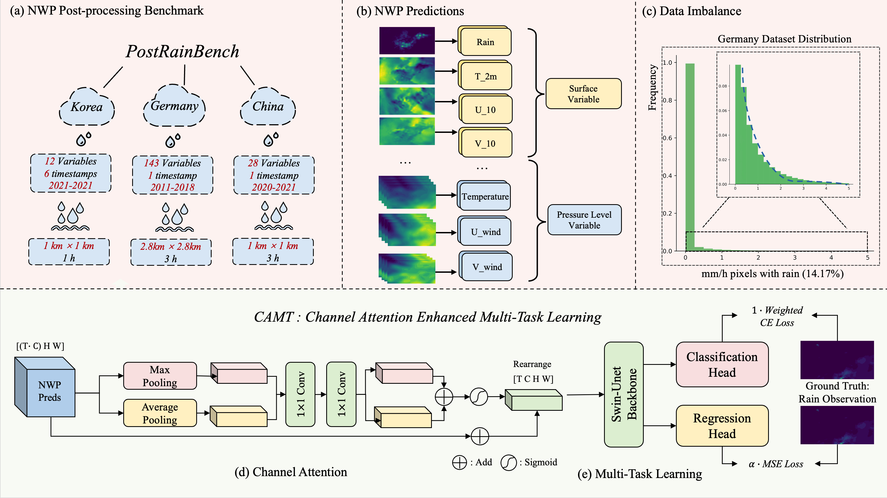
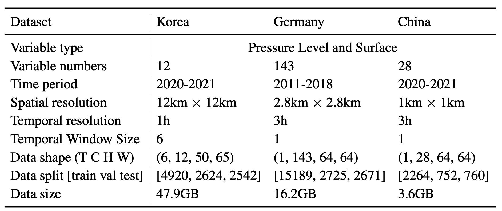
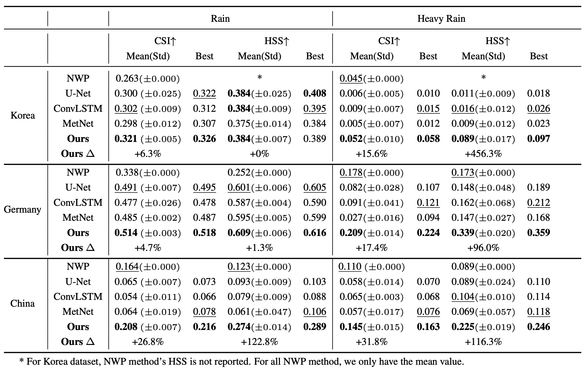
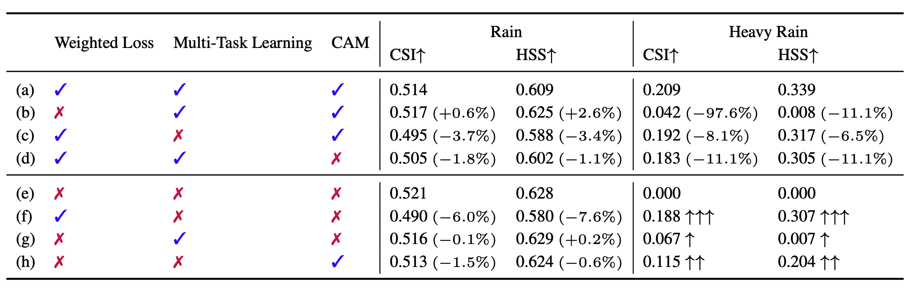

# PostRainBench


## Introduction

This is the official PyTorch implementation of PostRainBench: [PostRainBench: A comprehensive benchmark and a new model for precipitation forecasting](https://arxiv.org/abs/2310.02676).

**🎉🎉** PostRainBench was accepted  by ICLR24 Workshop: Tackling Climate Change with Machine Learning! 

## Overview



PostRainBench is a comprehensive multi-variable benchmark, which covers the full spectrum of scenarios with and without temporal information and various combinations of NWP input variables. We propose CAMT, a simple yet effective Channel Attention Enhanced Multi-task Learning framework with a specially designed weighted loss function. CAMT is flexible and can be plugged into different model backbones.

## Dataset

We summarize three NWP datasets with different spatial and temporal resolutions in the following table.



## Results

### 🏆 Achieve state-of-the-art in NWP Post-processing based Precipitation Forecasting

Extensive experimental results on the proposed benchmark show that our method outperforms state-of-the-art methods by 6.3%, 4.7%, and 26.8% in rain CSI on the three datasets respectively. Most notably, our model is the first deep learning-based method to outperform traditional Numerical Weather Prediction (NWP) approaches in extreme precipitation conditions. It shows improvements of 15.6%, 17.4%, and 31.8% over NWP predictions in heavy rain CSI on respective datasets. These results highlight the potential impact of our model in reducing the severe consequences of extreme weather events.



### 🌟 Alation Study

We conduct an ablation study by systematically disabling certain components of our CAMT Component and evaluating the CSI results for both rain and heavy rain. Specifically, we focus on the weighted loss, multi-task learning, and channel attention modules as these are unique additions to the Swin-Unet backbone.

In the first part, we use Swin-Unet with CAMT framework (a) as a baseline and we disable each component in CAMT and demonstrate their respective outcomes. In the second part, we use Swin-Unet without CAMT framework (e) as a baseline and we gradually add each component to the model to understand its role.



Although Swin-Unet can achieve a relatively high CSI when used alone (e), it does not have the ability to predict heavy rain. Importantly, these three enhancements complement each other. Weighted loss and multi-task learning are effective in improving simultaneous forecasting under the unbalanced distribution of light rain and heavy rain, while CAM provides comprehensive improvements.

## Dataset

Korea Dataset:

https://www.dropbox.com/sh/vbme8g8wtx9pitg/AAAB4o6_GhRq0wMc1JxdXFrVa?dl=0

Germany Dataset：

https://zenodo.org/records/7244319

China Dataset:

https://drive.google.com/file/d/1rBvxtQ8Gh9dXzh-okEOVpA8ZeDzr7yAI/view?usp=drive_link

## Code

Conda Environment

```
conda env create --file enviromental.yml
conda activate PRBench
```

For model training

```
bash scripts/SwinUnet_CAMT.sh
```

Key components of our model are encapsulated in:

- `/model/swinunet_model.py`: Defines the `SwinUnet_CAM_Two` class, incorporating the SwinUnet architecture, multi-task learning heads, and the Channel Attention Module.
- `losses.py`: Including the weighted loss and multi-task learning loss functions.

## Acknowledgement

We appreciate the following GitHub repo very much for the valuable code base and datasets:

https://github.com/osilab-kaist/KoMet-Benchmark-Dataset

https://github.com/DeepRainProject/models_for_radar

https://github.com/HuCaoFighting/Swin-Unet

## Contact

If you have any questions or find any bugs,feel free to open an issue on GitHub. You can also email me at tangyujin0275@gmail.com.

## Citation

If this work is helpful for your research, please consider citing the following BibTeX entry:

```
@article{tang2023postrainbench,
  title={PostRainBench: A comprehensive benchmark and a new model for precipitation forecasting},
  author={Tang, Yujin and Zhou, Jiaming and Pan, Xiang and Gong, Zeying and Liang, Junwei},
  journal={arXiv preprint arXiv:2310.02676},
  year={2023}
}
```
